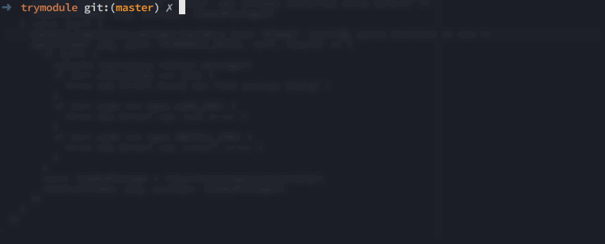

## trymodule

A simple cli tool for trying out different nodejs modules.

- Works well with Node 16 and higher versions.

- Support ES Module.

- Built with ESM and typescript.

## Installation

`npm install -g @jopemachine/trymodule`

## Usage

`trymodule colors`

Downloads the module colors if needed, and starts a nodejs REPL with colors loaded in the current scope, ready for you to use.

`trymodule colors lodash`

Same as above but with many packages in one go!

`trymodule colors=c lodash=l`

Assign packages to custom variable names.

`trymodule --clear`

Removes the directory where trymodules stores the node modules. Removes `TRYMODULE_PATH + '/node_modules'`

## Configuration

There are a couple of environment variables you can use to customize trymodule.

`TRYMODULE_PATH` for setting the path of where modules are stored. By default this is `$HOME/.trymodule` or `$USERPROFILE/.trymodule`

`TRYMODULE_NONINTERACTIVE` for making trymodule not fire up the repl in the end. This is useful if you want to just install some packages for future use. By default this is undefined. Setting it to any value would make trymodule non-interactive.

`TRYMODULE_HISTORY_PATH` for changing where to save the repl history. Should be pointing to a user write-able file. Defaults to `$TRYMODULE_PATH/repl_history`

You can set the environment variables for one session with `export TRYMODULE_PATH=/usr/bin/trymodule` or for just one time by doing `TRYMOUDLE_PATH=/usr/bin/trymodule trymodule colors`.

## Support / Help

If you have any questions, open a Github issue here:
[github.com/VictorBjelkholm/trymodule/issues/new](https://github.com/VictorBjelkholm/trymodule/issues/new)

or feel free to contact me on Twitter here:
[@VictorBjelkholm](https://twitter.com/VictorBjelkholm)

## Inspiration

Inspiration comes from a leiningen plugin called [lein-try](https://github.com/rkneufeld/lein-try) that allows you to try out clojure libraries without having to declare them in an existing project. Thanks to [@rkneufeld](https://github.com/rkneufeld) for the inspiration!

## License

The MIT License (MIT)

Copyright (c) 2016 Victor Bjelkholm

Permission is hereby granted, free of charge, to any person obtaining a copy of this software and associated documentation files (the "Software"), to deal in the Software without restriction, including without limitation the rights to use, copy, modify, merge, publish, distribute, sublicense, and/or sell copies of the Software, and to permit persons to whom the Software is furnished to do so, subject to the following conditions:

The above copyright notice and this permission notice shall be included in all copies or substantial portions of the Software.

THE SOFTWARE IS PROVIDED "AS IS", WITHOUT WARRANTY OF ANY KIND, EXPRESS OR IMPLIED, INCLUDING BUT NOT LIMITED TO THE WARRANTIES OF MERCHANTABILITY, FITNESS FOR A PARTICULAR PURPOSE AND NONINFRINGEMENT. IN NO EVENT SHALL THE AUTHORS OR COPYRIGHT HOLDERS BE LIABLE FOR ANY CLAIM, DAMAGES OR OTHER LIABILITY, WHETHER IN AN ACTION OF CONTRACT, TORT OR OTHERWISE, ARISING FROM, OUT OF OR IN CONNECTION WITH THE SOFTWARE OR THE USE OR OTHER DEALINGS IN THE SOFTWARE.
